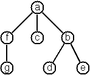
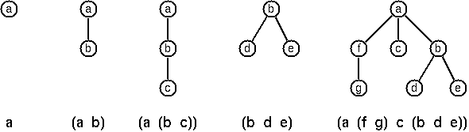

# Списки
Задачи 1-9 идут с коэффициентом 0.5

1. Достать последний элемент в списке
    ```haskell
    λ> myLast [1,2,3,4]
    4
    λ> myLast ['x','y','z']
    'z'
    λ> myLast "COMPILER PROTECTS!"
    '!'
    ```

2. Достать предпоследний элемент в списке
    ```haskell
    λ> butLast [1,2,3,4]
    3
    λ> butLast "COMPILER PROTECTS!"
    'T'
    ```

3. Достать n-й элемент в списке (индексация от 1)
    ```haskell
    λ> elementAt [1,2,3,4] 2
    3
    λ> elementAt "COMPILER PROTECTS!" 9
    ' '
    ```

4. Найти число элементов в списке
    ```haskell
    λ> myLength []
    0
    λ> myLength ["Tzeentch", "Nurgle", "Khorne", "Slaanesh"]
    4
    ```

5. Обратить список
    ```haskell
    λ> myReverse []
    []
    λ> myReverse "Lorem ipsum dolor sit amet"
    "tema tis rolod muspi meroL"
    ```

6. Проверить, что список является палиндромом
    ```haskell
    λ> pal [1, 2, 3]
    False
    λ> pal "арозаупаланалапуазора"
    True
    λ> pal [1,4,6,4,1]
    True
    ```

7. Схлопнуть список из, возможно, вложенных списков
    ```haskell
    data NestedList a = Elem a | List [NestedList a]
    λ> flatten (Elem 5)
    [5]
    λ> flatten (List [Elem 1, List [Elem 2, List [Elem 3, Elem 4], Elem 5]])
    [1,2,3,4,5]
    λ> flatten (List [])
    []
    ```

8. Убрать последовательные дубликаты. Относительный порядок не должен измениться
    ```haskell
    λ> compress "aaaabccaadeeee"
    "abcade"
    ```

9. Сгруппировать в списки одинаковые подряд идущие элементы. Относительный порядок не должен измениться
    ```haskell
    λ> pack ['a', 'a', 'a', 'a', 'b', 'c', 'c', 'a', 
             'a', 'd', 'e', 'e', 'e', 'e']
    ["aaaa","b","cc","aa","d","eeee"]
    ```

10. Сгруппировать элементы с подсчётом. Относительный порядок не должен измениться
    ```haskell
    λ> pack ['a', 'a', 'a', 'a', 'b', 'c', 'c', 'a', 
             'a', 'd', 'e', 'e', 'e', 'e']
    [(4,'a'),(1,'b'),(2,'c'),(2,'a'),(1,'d'),(4,'e')]
    ```

# Ещё списки

Задачи 11, 14, 17 и 20 идут с коэффициентом 0.5

11. Сгруппировать с подсчётом, но результат записывать не в пару, а в новый тип
    ```haskell
    data Encoding a = Single a | Multiple Int a
    λ> pack ['a', 'a', 'a', 'a', 'b', 'c', 'c', 'a', 
             'a', 'd', 'e', 'e', 'e', 'e']
    [ Multiple 4 'a'
    , Single 'b'
    , Multiple 2 'c'
    , Multiple 2 'a'
    , Single 'd'
    , Multiple 4 'e'
    ]
    ```

12. Разгруппировать списки из предыдущего пункта
    ```haskell
    data Encoding a = Single a | Multiple Int a
    λ> unpack $
        [ Multiple 4 'a'
        , Single 'b'
        , Multiple 2 'c'
        , Multiple 2 'a'
        , Single 'd'
        , Multiple 4 'e'
        ]
    "aaaabccaadeeee"
    ```
13. Снова пересчитать подряд идущие одинаковые элементы списка, но не создавать по ходу дела дополнительные списки, т.е. пересчитывать на лету
    ```haskell
    λ> encodeDirect "aaaabccaadeeee"
    [Multiple 4 'a',Single 'b',Multiple 2 'c',
    Multiple 2 'a',Single 'd',Multiple 4 'e']
    ```

14. Размножить в два раза каждый элемент списка
    ```haskell
    λ> dup [1, 2, 3]
    [1,1,2,2,3,3]
    λ> dup "Imperium"
    "IImmppeerriiuumm"
    ```
15. Размножить в n раз каждый элемент списка
    ```haskell
    λ> rep 2 [1, 2, 3]
    [1,1,2,2,3,3]
    λ> rep 3 "Imperium"
    "IIImmmpppeeerrriiiuuumm"
    ```

16. Выкинуть каждый n-й элемент в списке
    ```haskell
    λ> dropEvery 3 "abcdefghik"
    "abdeghk"
    λ> dropEvery 3 ["Rogal", "Roboute", "Magnus", "Leman",
        "Corvus", "Horus", "Alpharius", "Omegon", "Fulgrim"]
    ["Rogal", "Roboute", "Leman", "Corvus", "Alpharius", "Omegon"]
    ```

17. Разбить список на два в заданной позиции
    ```haskell
    λ> split "abcdefghik" 3
    ("abc", "defghik")
    ```

18. Извлечь из списка кусок по заданным индексам
    ```haskell
    λ> slice ['a','b','c','d','e','f','g','h','i','k'] 3 7
    "cdefg"
    ```

19. Сдвинуть элементы в списке на n влево. Можно использовать библиотечные функции length и (++)
    ```haskell
    λ> rotate ['a','b','c','d','e','f','g','h'] 3
    "defghabc"

    λ> rotate ['a','b','c','d','e','f','g','h'] (-2)
    "ghabcdef"
    ```

20. Удалить элемент в заданной позиции, вернуть пару из него и обновлённого списка
    ```haskell
    λ> removeAt 2 "abcd"
    ('b',"acd")
    ```

# Ещё списки

21. Вставить элемент по заданной позиции
    ```haskell
    λ> insertAt 'X' "abcd" 2
    "aXbcd"
    ```

22. Создать список целых чисел из заданного диапазона
    ```haskell
    λ> range 4 9
    [4,5,6,7,8,9]
    ```

23. Извлечь случайный набор заданной длины
    ```haskell
    λ> rnd_select "abcdefgh" 3 >>= putStrLn
    eda
    ```

24. (Лотерея) Вытянуть N различных случайных чисел из набора 1..M
    ```haskell
    λ> diff_select 6 49
    [23,1,17,33,21,37]
    λ> diff_select 3 10
    [10, 9, 8]
    ```
    Если с первой попытки вытяните последний тест, то задача пойдёт с коэффициентом x10

25. Сгенерировать случайную перестановку списка
    ```haskell
    λ> rnd_permu "abcdef"
    "badcef"
    ```

26. Сгенерировать все сочетания длины K из заданного списка
    ```haskell
    λ> combinations 3 "abcdef"
    ["abc","abd","abe",...]
    ```

27. Сгруппировать элементы списка в наборы непересекающихся множеств заданного размера
    ```haskell
    λ> group [2,3,4] ["aldo","beat","carla","david","evi","flip","gary","hugo","ida"]
    [[["aldo","beat"],["carla","david","evi"],["flip","gary","hugo","ida"]],...]
    (всего 1260 вариантов)

    λ> group [2,2,5] ["aldo","beat","carla","david","evi","flip","gary","hugo","ida"]
    [[["aldo","beat"],["carla","david"],["evi","flip","gary","hugo","ida"]],...]
    (всего 756 вариантов)
    ```

28. Сортировать список списков в соответствии с длиной списков -- чем короче, тем меньше
    ```haskell
    λ> lsort ["abc","de","fgh","de","ijkl","mn","o"]
    ["o","de","de","mn","abc","fgh","ijkl"]
    ```
29. Не судьба

30. Не судьба

# Арифметика

31. Проверить число на простоту
    ```haskell
    λ> isPrime 7
    True
    ```

32. Найти НОД двух чисел
    ```haskell
    λ> [myGCD 36 63, myGCD (-3) (-6), myGCD (-3) 6]
    [9,3,3]
    ```

33. (x0.5) Два числа взаимно просты?

34. Функция Эйлера -- количество чисел, меньших заданного, и в.п. с ним -- по определению, т.е. перебором
    ```haskell
    λ> totient 10
    4
    ```

35. Разложить число на простые множители. Построить список из них, расположенных по возрастанию
    ```haskell
    λ> primeFactors 315
    [3, 3, 5, 7]
    ```

36. Разложить число на простые множители. Построить список пар (простой множитель, его кратность), упорядоченных по возрастанию множителя

37. Функция Эйлера -- ускоренная (через произведение)

38. Бенчмаркнуть по времени и памяти реализации функции Эйлера из реализаций 34 и 36

39. Сгенерировать список простых чисел из заданного диапазона
    ```Haskell
    λ> primesR 10 20
    [11,13,17,19]
    ```

40. Гипотеза Гольдбаха -- разложить любое чётное число, большее двух, в сумму двух простых
    ```haskell
    λ> goldbach 28
    (5, 23)
    ```
    Если придумаете контрпример, то отл(10) автоматом без показа остальных задач

41. Гипотеза Гольдбаха - 2. Дан диапазон чисел, распечатать список разложений по Гольдбаху для всех чётных чисел диапазона. Дополнение (+1 к задаче): одно из двух чисел разложения обычно сильно меньше другого. Довольно редко оба из них больше, например, 50. Необходимо выдать такие разложения.
    ```haskell
    λ> goldbachList 9 20
    [(3,7),(5,7),(3,11),(3,13),(5,13),(3,17)]
    λ> goldbachList' 4 2000 50
    [(73,919),(61,1321),(67,1789),(61,1867)]
    ```
42-45. Не судьба

# Алгебра логики и кодирование

46. Определить функции or, xor, nor, and, nand, impl и eq (not можно взять из коробки). Составить таблицу истинности для заданного выражения
    ```haskell
    λ> table (\a b -> (and' a (or' a b)))
    True True True
    True False True
    False True False
    False False False
    ```

47. (x1.5) Адаптировать таблицу истинности, чтобы принимала на вход количество переменных и функцию от их списка
    ```haskell
    λ> tablen 3 (\[a,b,c] -> a `and'` (b `or'` c) `equ'` a `and'` b `or'` a `and'` c)
    -- infixl 3 `equ'`
    True  True  True  True
    True  True  False True
    True  False True  True
    True  False False True
    False True  True  True
    False True  False True
    False False True  True
    False False False True

    -- infixl 7 `equ'`
    True  True  True  True
    True  True  False True
    True  False True  True
    True  False False False
    False True  True  False
    False True  False False
    False False True  False
    False False False False
    ```

48. Код Грея — двоичный код, иначе зеркальный код, он же код с отражением, в котором две «соседние» (в упорядоченном, то есть лексикографическом, наборе) кодовые комбинации различаются только цифрой в одном двоичном разряде.
Примеры:

    ```
    n = 1: C(1) = ['0','1']
    n = 2: C(2) = ['00','01','11','10']
    n = 3: C(3) = ['000','001','011','010',´110´,´111´,´101´,´100´]
    ```
Написать функцию, которая генерирует коды Грея

    ```haskell
    λ> gray 3
    ["000","001","011","010","110","111","101","100"]
    ```

49. Коды Хаффмана. Дан список пар (символ, встречаемость), и надо построить бинарный код Хаффмана
    ```haskell
    λ> huffman [('a',45),('b',13),('c',12),('d',16),('e',9),('f',5)]
    [('a',"0"),('b',"101"),('c',"100"),('d',"111"),('e',"1101"),('f',"1100")]
    ```

50-54. Не судьба

# Бинарные деревья

Представляются как
    ```haskell
    data Tree a = Null | Node a (Tree a) (Tree a)
        deriving (Show, Eq) -- для удобства
    ```

55. Написать генератор полностью сбалансированных (число узлов в левом и правом поддеревьях относительно любого узла отличается не более чем на 1) деревьев: по заданному числу n выдаёт список всех деревьев, у которых глубина n и они сбалансированы. В качестве хранимой информации можно записать крестик или юнит.
    ```haskell
    λ> cbalTree 4
    [
    -- permutation 1
    --     x
    --    / \
    --   x   x
    --        \
    --         x
    Node 'x' (Node 'x' Null Null) 
            (Node 'x' Null 
                        (Node 'x' Null Null)),

    -- permutation 2
    --     x
    --    / \
    --   x   x
    --      /
    --     x
    Node 'x' (Node 'x' Null Null) 
            (Node 'x' (Node 'x' Null Null) 
                        Null),

    -- permutation 3
    --     x
    --    / \
    --   x   x
    --    \
    --     x
    Node 'x' (Node 'x' Null 
                        (Node 'x' Null Null)) 
            (Node 'x' Null Null),

    -- permutation 4
    --     x
    --    / \
    --   x   x
    --  /
    -- x
    Node 'x' (Node 'x' (Node 'x' Null Null) 
                        Null) 
            (Node 'x' Null Null)
    ]
    ```

56. Симметричые деревья. Назовём деревья симметричными, если можно провести линию через корень, и левое поддерево будет зеркальным отражением правого. Написать предикатную функцию, которая проверяет симметричность. Поскольку важна форма деревьев, а не содержание, в качестве содержимого снова можно записать крестик, юнит, ноль и др. 

57. Бинарные деревья поиска. Нужна функция, которая из списка чисел собирает бинарное дерево поиска
    ```haskell
    λ> construct [3, 2, 5, 7, 1]
    Node 3 (Node 2 (Node 1 Null Null) Null) (Node 5 Null (Node 7 Null Null))
    ```

58. Написать генератор полностью сбалансированных деревьев заданной глубины, которые, к тому же, симметричные. См. 55 и 56. Благословляется подход generate-and-test
    ```haskell
    λ> symCbalTrees 5
    [Node 'x' (Node 'x' Null (Node 'x' Null Null)) (Node 'x' (Node 'x' Null Null) Null),Node 'x' (Node 'x' (Node 'x' Null Null) Null) (Node 'x' Null (Node 'x' Null Null))]
    ```


59. Написать генератор деревьев, сбалансированных по высоте: относительно любого узла высота левого и правого поддеревьев отличается не более чем на 1. Высота дерева -- максимум из высот левого и правого поддеревьев + 1
    ```haskell
    λ> take 4 $ hbalTree 'x' 3
    [Node 'x' (Node 'x' Null Null) (Node 'x' Null (Node 'x' Null Null)),
    Node 'x' (Node 'x' Null Null) (Node 'x' (Node 'x' Null Null) Null),
    Node 'x' (Node 'x' Null Null) (Node 'x' (Node 'x' Null Null) (Node 'x' Null Null)),
    Node 'x' (Node 'x' Null (Node 'x' Null Null)) (Node 'x' Null Null)]
    ```

60. Написать генератор сбалансированных (по высоте) деревьев с заданным числом узлов
    ```
    λ> length $ hbalTreeNodes 'x' 15
    1553
    λ> map (hbalTreeNodes 'x') [0..3]
    [[Null],
    [Node 'x' Null Null],
    [Node 'x' Null (Node 'x' Null Null),Node 'x' (Node 'x' Null Null) Null],
    [Node 'x' (Node 'x' Null Null) (Node 'x' Null Null)]]
    ```

# Ещё деревья

Задачи 66-68 идут как x1.5

В последующих тестах может быть вот такое дерево:

    ```haskell
    tree4 = Node 1 (Node 2 Null (Node 4 Null Null)) (Node 2 Null Null)
    ```

61. Пересчитать листья в бинарном дереве. Лист -- это узел без потомков
    ```haskell
    λ> countLeaves tree4
    2
    ```

62. Собрать в список значения из листьев
    ```haskell
    λ> leaves tree4
    [4, 2]
    ```

63. Собрать в список значения всех остальных узлов (т.е. которые не листья)
    ```haskell
    λ> internals tree4
    [1, 2]
    ```

64. Собрать все значения на заданной глубине
    ```haskell
    λ> atLevel tree4 2
    [2, 2]
    ```

65. Построить полное бинарное дерево: на глубине n находится $$2^n$$ узлов (корень на глубине 0), кроме, тбыть может, последнего уровня. Там элементы расположены слева направо, насколько их хватает.
    ```haskell
    λ> completeBinaryTree 4
    Node 'x' (Node 'x' (Node 'x' Null Null) Null) (Node 'x' Null Null)

    λ> isCompleteBinaryTree $ Node 'x' (Node 'x' Null Null) (Node 'x' Null Null)
    True
    ```

66. Создать функцию, которая аннотирует узлы дерева в соответствии с некоторой стратегией расположения узлов на сетке. Суть стратегии:

    * координата x узла v равна позиции узла v в in-order обходе
    * координата y узла v равна его глубине

    </img>

    ```haskell
    -- вот так дерево может быть задано
    tree66 = Node 'n'
                    (Node 'k'
                            (Node 'c'
                                    (Node 'a' Null Null)
                                    (Node 'h'
                                            (Node 'g'
                                                    (Node 'e' Null Null)
                                                    Null
                                            )
                                            Null
                                    )
                            )
                            (Node 'm' Null Null)
                    )
                    (Node 'u'
                            (Node 'p'
                                    Null
                                    (Node 's'
                                            (Node 'q' Null Null)
                                            Null
                                    )
                            )
                            Null
                    )

    λ> layout tree66
    Node ('n',(8,1)) (Node ('k',(6,2)) (Node ('c',(2,3)) ...
    ```

67. см. 66, но другая стратегия расположения на сетке.

    x(v) -- ?, но известно, что расстояние между узлами одной глубины совпадает
    y(v) -- глубина узла

    </img>

    ```haskell
    tree67 = Node 'n'
                    (Node 'k'
                            (Node 'c'
                                    (Node 'a' Null Null)
                                    (Node 'e'
                                            (Node 'd' Null Null)
                                            (Node 'g' Null Null)
                                    )
                            )
                            (Node 'm' Null Null)
                    )
                    (Node 'u'
                            (Node 'p'
                                    Null
                                    (Node 'q' Null Null)
                            )
                            Null
                    )

    λ> layout tree67
    Node ('n',(15,1)) (Node ('k',(7,2)) (Node ('c',(3,3)) ...
    ```

68. См. 66. Стратегию выцепить из картинки. Подсказка: обратить внимание на расстояние между узлом и его потомками, а также на горизонтальное расстояние между ними. Насколько плотно можно сдвинуть два дерева, чтобы собрать их в новое, комбинированное дерево?

    ```haskell
    tree67 = Node 'n'
                    (Node 'k'
                            (Node 'c'
                                    (Node 'a' Null Null)
                                    (Node 'e'
                                            (Node 'd' Null Null)
                                            (Node 'g' Null Null)
                                    )
                            )
                            (Node 'm' Null Null)
                    )
                    (Node 'u'
                            (Node 'p'
                                    Null
                                    (Node 'q' Null Null)
                            )
                            Null
                    )

    λ> layout tree67
    Node ('n',(5,1)) (Node ('k',(3,2)) (Node ('c',(2,3)) ...
    ```

69. Реализовать preOrder и postOrder обходы дерева, элементы собрать в список

    ```haskell
    λ> tree = Node 'x' (Node 'y' Null Null) (Node 'z' Null Null)
    λ> preOrder tree
    "xyz"
    λ> postOrder tree
    "yzx"
    ```

70. Частотный словарь: по данной последовательности построить дерево, запоминая для каждого элемента его значение и количество его повторений в последовательности.
    ```haskell
    λ> inOrder . fdict $ [7, 7, 9, 1, 7, 1, 0]
    [(1, 2), (7, 3), (9, 1)]
    ```

# Многодетные деревья

В данном разделе рассматриваем деревья, которые состоят из корня и, возможно, пустого списка потомков, каждый из которых тоже многодетное дерево. По умолчанию считаем такими деревья непустыми


```haskell
data Tree a = Node a [Tree a] deriving (Eq, Show)

tree1 = Node 'a' []

tree2 = Node 'a' [Node 'b' []]

tree3 = Node 'a' [Node 'b' [Node 'c' []]]

tree4 = Node 'b' [Node 'd' [], Node 'e' []]

tree5 = Node 'a' [ Node 'f' [Node 'g' []]
                 , Node 'c' []
                 , Node 'b' [Node 'd' [], Node 'e' []]
                 ]
```

</img>

71. Положим, в узлах хранятся единичные символы. В обходе depth-first будем писать символ "^", когда поднимаемся на один уровень вверх относительно текущего в порядке подхода. Таким образом, дерево с картинки отображается в виде строки как "afg^^c^bd^e^^^".
Требуется построить функции treeToString и stringToTree, которые переводят многодетное дерево в указанное строковое представление и обратно

    ```haskell
    λ> stringToTree "afg^^c^bd^e^^^"
    Node 'a' [Node 'f' [Node 'g' []],Node 'c' [],Node 'b' [Node 'd' [],Node 'e' []]]

    λ> treeToString (Node 'a' [Node 'f' [Node 'g' []],Node 'c' [],Node 'b' [Node 'd' [],Node 'e' []]])
    "afg^^c^bd^e^^^"
    ```

72. Посчитать internal path length -- суммарную длину из корня до всех его потомков

    ```haskell
    λ> ipl tree5
    9
    λ> ipl tree4
    2
    ```

73. Лисп-подобное представление деревьев. В лиспе каждый узел представлен списком: первый элемент -- само значение узла, последующие элементы -- потомки узла.

    </img>

    ```haskell
    λ> displayLisp tree1
    "a"
    λ> displayLisp tree2
    "(a b)"
    λ> displayLisp tree3
    "(a (b c))"
    λ> displayLisp tree4
    "(b d e)"
    λ> displayLisp tree5
    "(a (f g) c (b d e))"
    ```

74-79. Не судьба

# Графы -- РАЗДЕЛ ДОПИСЫВАЕТСЯ

Все задачи данного раздела, если не указано иное, стоят х1.5

80. Рёбра в графе можно представить матрицей смежности, списком рёбер и списком смежности

    ```haskell
    type G1 v = Graph [v] (Array (v, v) Int) deriving (Show, Eq)
    type G2 v = Graph [v] [(v, v)] deriving (Show, Eq)
    type G3 v = Graph [v] [(v, [v])] deriving (Show, Eq)
    ```

    Написать конвертирующие функции между всеми типами графов.

81. (x5 +n) Рассмотрим тайпкласс графов

    ```haskell
    class Graph g where
        vertices :: g v e -> [v]
        edges    :: g v e -> [e]
        isVert   :: v -> g v e -> Bool
        isEdge   :: e -> g v e -> Bool
        edgeWeight :: Num a -> e -> a 
        edgesWithWeights :: Num a => g v e -> [(e, a)]
        edgesAdjMat :: (Ix v, Num a) => g v e -> Array (v, v) a -- конвертирование в G1
        ...
    ```
    Устранить, если есть, недостатки такой абстракции над графами. Допускается использование других коллекций, а не списков, для функций vertices и edges. Сделать типы G1, G2 и G3 экземплярами тайпкласса Graph. Реализовать задачи 83+ в обобщённом виде. +1 за каждую задачу

82. Для каждого типа графа из 80 создать функцию, которая из строки создаёт граф, где вершины представляют собой целые числа.
    Матрица смежности первого типа графов задаётся целыми числами, разделёнными пробелом, и каждая строка разделяется переносом строки. Для удобства см. функции words и lines
    Список рёбер задаётся парами чисел, разделённых пробелом, а сами пары разделены переносом строки.
    Список смежности аналогичен случаю с матрицами, только первое число - то число, относительно которого рассчитывается список смежности


В следующих задачах можно использовать произвольное представление графов

83. Дан граф и пара вершин. Надо проверить, есть ли путь между ними

84. Дан взвешенный неориентированный граф. Построить функцию из графа в граф, которая строит минимальное остовное дерево

85. Написать функции обходов в ширину и в глубину:
    
    ```haskell
    -- выдать список вершин в порядке обхода в ширину
    bfs :: Graph v => g v e -> [v]
    -- -//- в глубину
    dfs :: Graph v => g v e -> [v] 
    ```

86. (х2) Алгоритм Дейкстры. По графу найти кратчайшие пути из заданной вершины до всех остальных. Вывести как список пар (вершина, расстояние от заданной)
    

